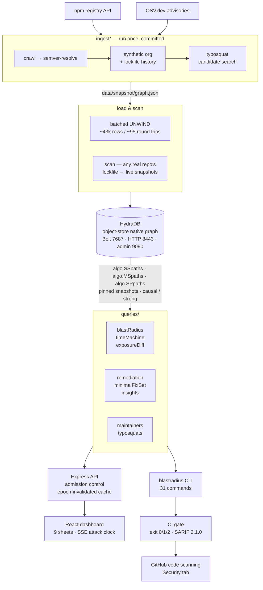

# Blast Radius

**A live, queryable supply-chain attack graph, built on [HydraDB](https://github.com/hydra-db/hydradb).**

> A package is compromised at 09:00. Which of your services are exposed by 09:06?

Every tool in this space — Socket, Snyk, OSV-Scanner, JFrog, Cloudsmith,
`depscan` — answers that with a static scan of your *current* lockfiles. That
tells you what you ship today. It cannot tell you what you shipped at 09:03,
while the malicious artifact was live, because it has no notion of what was true
then.

Blast Radius keeps the whole npm dependency graph *and* your organisation's
lockfile history in a graph database, so both questions are ordinary queries:

- **Exposed now** — walk `RESOLVED_TO` backwards from the compromised version to
  every repository that depends on it, transitively, with the dependency chain
  that explains why.
- **Exposed *then*** — the **Lockfile Time Machine**: which repositories had a
  lockfile that resolved to the bad version *during the exact window it was
  live*. A repo that has since upgraded looks clean to every scanner on the
  market. It still ran the malicious build.

Those two sets are different, and the difference is the product.

```
EXPOSED NOW  vs  EXPOSED DURING THE WINDOW
repo                      exposed now     during window
----------------------------------------------------------
admin-dashboard           yes             yes
customer-portal           yes             no
design-system             yes             no
internal-cli-tool         yes             yes
notifications-worker      no              yes
onboarding-frontend       no              yes
payments-service          yes             yes
search-indexer            no              yes

! 3 repos were exposed during the incident but are clean now:
  search-indexer, notifications-worker, onboarding-frontend
  A scanner that only reads current lockfiles reports these as safe.
  They ran the malicious build.
```

---

## Install

Blast Radius is a Node package. It needs no clone, and it needs no Docker of
its own — only a HydraDB engine to talk to.

```bash
npx blast-radius doctor          # no install
npm install -g blast-radius      # or keep it around
```

Point it at any engine you already run:

```bash
HYDRA_HTTP_URL=http://your-host:8443 blastradius exposure npm:debug@4.4.3
```

### If you need an engine

HydraDB is a Rust binary that links `libcypher-parser`, a C library with no
Homebrew formula — which is exactly why the sponsor ships it as an image rather
than expecting you to build it. One container, local-filesystem storage, no
object store and no compose file:

```bash
docker volume create hydradb-data
docker run --rm --user 0:0 -v hydradb-data:/data --entrypoint /bin/sh \
  ghcr.io/hydra-db/hydradb:latest -c 'mkdir -p /data/store /data/cache; \
  printf "%s\n" "local-development-token-32-bytes" > /data/auth-token; \
  chown -R 10001:10001 /data'

docker run -d --name hydradb -p 8443:8443 -p 7687:7687 -p 9090:9090 \
  -e CLOUD_PROVIDER=local -e LOCAL_PATH=/data/store \
  -e GRAPH_NAMESPACE=default -e GRAPH_ID=default -e GRAPH_CELL_ID=cell-0 \
  -e GRAPH_CELLS=cell-0 -e GRAPH_NODE_ID=node-0 \
  -e GRAPH_BOLT_NODE_ADDRESSES=node-0=127.0.0.1:7687 \
  -e GRAPH_ADVERTISED_BOLT_ADDR=127.0.0.1:7687 \
  -e GRAPH_DATA_CACHE_DIR=/data/cache \
  -e GRAPH_AUTH_TOKEN_FILE=/data/auth-token -e GRAPH_ALLOW_PLAINTEXT=true \
  -v hydradb-data:/data ghcr.io/hydra-db/hydradb:latest
```

Then load the graph that ships in the package and open the dashboard:

```bash
blastradius load && blastradius arm
blastradius serve
```

The first step writes an id map to `.blastradius/` in the working directory —
state belongs next to you, not inside `node_modules`, where the next install
would delete it.

The repository's `docker-compose.yml` runs the same engine against MinIO
instead, because the point of this project is HydraDB on an S3-compatible
object store. The single-container form above is for reading the code without
standing that up.


## Contents

- [Quick start](#quick-start)
- [What is in the graph](#what-is-in-the-graph)
- [Usage — nine worked examples](#usage--nine-worked-examples)
- [The rest of the CLI](#the-rest-of-the-cli)
- [The dashboard](#the-dashboard)
- [How HydraDB is used](#how-hydradb-is-used)
- [What this project loses without HydraDB](#what-this-project-loses-without-hydradb)
- [Architecture](#architecture)
- [Configuration](#configuration)
- [Tests](#tests)
- [Data sources and attribution](#data-sources-and-attribution)
- [License](#license)

---

## Quick start

Requirements: **Docker**, **Node 20+**. Nothing else — HydraDB and its MinIO
object store both run from published images, and the graph snapshot is
committed, so the demo needs no network access beyond `npm install`.

```bash
git clone <this repo> && cd blast
make demo
```

`make demo` builds the packages, starts HydraDB on a clean volume, loads the
vendored graph (~43k rows in ~95 batched round trips, about 2 seconds), and
marks the demo incident compromised. Then:

```bash
make exposure       # full blast radius        (algo.SSpaths)
make time-machine   # exposed now vs exposed then
make maintainers    # shared-maintainer risk   (algo.SSpaths over MAINTAINS)
make typosquats     # near-name packages
make simulate       # replay the worm with a live attack clock
make remediate      # what to change to clear the exposure
make scan           # scan this very repository's lockfile into the graph
make serve          # dashboard on http://127.0.0.1:4000
```

`make doctor` verifies connectivity, asserts every engine capability the project
depends on, and connects a stock Neo4j driver over Bolt. Run it first if
anything looks wrong.

### The `blastradius` command

Every example below is written as `blastradius …`. To make that literal:

```bash
make install-cli     # npm link — puts `blastradius` on your PATH
```

Without it, run `./bin/blastradius …` straight from the clone — same binary, no
install step.

To rebuild the graph from the live registry instead of the committed snapshot:

```bash
make ingest         # ~90s: npm registry + OSV.dev, cached under data/cache/
make load
```

---

## What is in the graph

The package graph is **real**, crawled from the public npm registry. Only the
organisation on top of it is synthetic — a plausible company whose repositories
depend on real packages, with a generated history of lockfile captures.

| | count |
|---|---|
| `Package` | 1,399 |
| `Version` | 12,351 |
| `Maintainer` | 313 |
| `Repo` | 18 |
| `LockfileSnapshot` | 123 |
| `RESOLVED_TO` edges | 9,846 |
| `RESOLVED` edges | 6,942 |
| `MAINTAINS` edges | 815 |
| `NAME_SIMILAR_TO` edges | 200 |
| real OSV advisories matched | 40 |

Seeded from ~300 of the most-depended-on npm packages and expanded through their
real dependency trees. Version ranges are resolved to concrete versions with
`semver`, exactly as a package manager would, so `RESOLVED_TO` is a real
resolution rather than a guess.

### Schema

**Nodes** — `Package`, `Version`, `Maintainer`, `Org`, `Repo`, `LockfileSnapshot`

**Relationships**

| edge | meaning |
|---|---|
| `(:Version)-[:DEPENDS_ON {range, kind}]->(:Package)` | a declared dependency — a *range*, unresolved |
| `(:Version)-[:RESOLVED_TO]->(:Version)` | what that range actually resolves to |
| `(:Maintainer)-[:MAINTAINS]->(:Package)` | who can publish |
| `(:LockfileSnapshot)-[:RESOLVED {direct}]->(:Version)` | every version this lockfile pinned |
| `(:LockfileSnapshot)-[:RESOLVED_DIRECT]->(:Version)` | just the direct dependencies |
| `(:Repo)-[:HAS_SNAPSHOT]->(:LockfileSnapshot)` | a repo's lockfile history |
| `(:Package)-[:NAME_SIMILAR_TO {distance, score, reason}]->(:Package)` | precomputed typosquat proximity |

Two modelling decisions are worth explaining, because both were forced by real
behaviour rather than chosen on paper:

**Why `DEPENDS_ON` *and* `RESOLVED_TO`.** A range is what a manifest says; a
resolution is what a build actually did. Conflating them is precisely what makes
a scanner unable to answer "who shipped the bad build".

**Why `RESOLVED` *and* `RESOLVED_DIRECT`.** A lockfile pins its entire tree, not
just the packages you named — so `RESOLVED` has an edge to every transitive
package. That completeness is what the Time Machine needs: "this lockfile pinned
this precise version" must be a single-hop fact. But it is the wrong edge to
traverse for a blast radius: because every transitive package is *also* pinned
directly, a shortest-path traversal takes the one-hop shortcut and reports every
exposure as depth 1, losing the chain that explains it. Blast radius therefore
enters through `RESOLVED_DIRECT` and walks `RESOLVED_TO` from there, recovering
the real dependency chain. Both edges are honest; they answer different
questions.

---

## Usage — nine worked examples

Every command below is real, copy-pasteable, and produces the output shown after
`make demo`. The compromised package is whatever ingestion recorded in the
snapshot — `blastradius incident` prints it, and the Makefile targets read it
from there so nothing drifts.

### 1 — Mark a package compromised, then get the full report

```bash
blastradius mark-compromised npm:debug@4.4.3 \
    --from "2026-08-14T09:00:00Z" --to "2026-08-14T09:06:00Z" \
    --advisory BLAST-DEMO-2026-0001

blastradius exposure npm:debug@4.4.3
```

```
BLAST RADIUS REPORT — npm:debug@4.4.3
compromise window 2026-08-14T09:00:00Z → 2026-08-14T09:06:00Z  (BLAST-DEMO-2026-0001)
Currently exposed (live graph, causal read):
  repo: admin-dashboard          depth 2   path: admin-dashboard
                                                 -> yeoman-generator@8.1.2
                                                 -> debug@4.4.3
  repo: customer-portal          depth 2   path: customer-portal
                                                 -> finalhandler@2.1.1
                                                 -> debug@4.4.3
  repo: internal-cli-tool        depth 2   path: internal-cli-tool
                                                 -> istanbul-lib-source-maps@5.0.0
                                                 -> debug@4.4.3
  repo: payments-service         depth 2   path: payments-service
                                                 -> https-proxy-agent@9.1.0
                                                 -> debug@4.4.3
  repo: design-system            depth 3   path: design-system -> serve-static@2.2.1
                                                 -> send@1.2.1 -> debug@4.4.3

Exposed only through a superseded lockfile (upgraded since — see `blastradius time-machine`):
  repo: auth-gateway             depth 2   lockfile 2026-07-24T14:55:30Z
  ...

Exposed packages in the dependency graph: 226
Query time: 7ms  (algo.SSpaths, maxLen=10, pathCount=20000)
Paths returned: 1024
```

Those are real npm packages and real dependency chains. `design-system` is
exposed three hops deep, through `serve-static → send → debug`.

Add `--which-version` to print the version timeline showing where the flaw
entered, and `--verified` to read with strong consistency.

### 2 — Exposure during the exact live window (the killer query)

```bash
blastradius time-machine npm:debug@4.4.3 --verified
```

```
LOCKFILE TIME MACHINE — exposure window 09:00:00–09:06:00 UTC, Aug 14 2026
package: npm:debug@4.4.3

Snapshots resolved to the bad version DURING the window:
  repo: search-indexer           lockfile captured 09:00:09Z  ← EXPOSED DURING WINDOW
  repo: notifications-worker     lockfile captured 09:01:39Z  ← EXPOSED DURING WINDOW
  repo: onboarding-frontend      lockfile captured 09:02:22Z  ← EXPOSED DURING WINDOW
  repo: payments-service         lockfile captured 09:04:02Z  ← EXPOSED DURING WINDOW
  repo: admin-dashboard          lockfile captured 09:04:49Z  ← EXPOSED DURING WINDOW
  repo: internal-cli-tool        lockfile captured 09:05:00Z  ← EXPOSED DURING WINDOW

Snapshots that have since upgraded past the bad version
(no longer live-exposed, but WERE exposed during the incident — still worth a security review):
  repo: search-indexer           captured 09:00:09Z, superseded 10:10:47Z
  repo: notifications-worker     captured 09:01:39Z, superseded 09:50:13Z
  repo: onboarding-frontend      captured 09:02:22Z, superseded 10:08:27Z

Still pinned to the bad version right now:
  repo: payments-service         captured 09:04:02Z  ← STILL EXPOSED
  repo: admin-dashboard          captured 09:04:49Z  ← STILL EXPOSED
  repo: internal-cli-tool        captured 09:05:00Z  ← STILL EXPOSED

Query time: 38ms  (strong consistency, pinned snapshot, verified)
Read epoch: 97
```

Followed by the side-by-side comparison at the top of this README. `--verified`
reads with `strong` consistency, which refreshes from object storage before
pinning the snapshot — so the answer is guaranteed to include every write
committed before the query began.

### 3 — Proactive maintainer risk, before anything is compromised

```bash
blastradius maintainers npm:debug
```

```
SHARED-MAINTAINER RISK for npm:debug
  maintainers: tootallnate, qix

  npm:color-convert                  shares maintainer "qix"
  npm:util-deprecate                 shares maintainer "tootallnate"
  npm:bcrypt                         shares maintainer "tootallnate"

Risk score: LOW (no other package sharing a maintainer with debug is in your dependency set)
Query time: 11ms  (algo.SSpaths over MAINTAINS, relDirection='both', maxLen=2)
```

A compromised publish credential compromises every package it can publish to.
One `algo.SSpaths` call over `MAINTAINS` with `relDirection: 'both'` and
`maxLen: 2` walks `Package ← Maintainer → Package`, so the reason for the risk
comes back with the risk. Risk is scored by how many of *your* dependencies sit
behind one account.

### 4 — Typosquat check against your own dependency list

```bash
blastradius typosquats --org acme-corp
```

```
POSSIBLE TYPOSQUATS of your top dependencies (org: acme-corp)
  "inherits" vs "@ryancavanaugh/inherits"  (edit distance 0)
                                           10 weekly downloads and a high-risk edit pattern — SUSPICIOUS
                                           same package name as "inherits" under different ownership (dependency confusion)
                                           first published 2016-05-17T03:49:59Z

  "supports-color" vs "@cjser/supports-color" (edit distance 0)
                                           published 21 days ago with 10 weekly downloads — SUSPICIOUS
                                           same package name as "supports-color" under different ownership

  "performance-now" vs "performancenow"    (edit distance 1)
                                           4 weekly downloads — SUSPICIOUS
                                           punctuation variant of "performance-now"

Summary: 84 suspicious, 16 watch, 100 likely legitimate
```

These are **real packages on npm**, found by searching the registry for names
near the org's own dependencies — the dependency crawl only ever reaches
packages that are legitimately depended on, so a squat is by construction not in
anybody's tree and has to be searched for.

Proximity alone decides nothing: `preact` is one edit from `react` and entirely
legitimate. The graph stores the edge *and the reason*, and the verdict combines
the kind of edit with the candidate's age and download volume.

### 5 — Full incident simulation

```bash
blastradius simulate --scenario tanstack-worm-2026
```

```
INCIDENT SIMULATION — TanStack-style self-propagating npm worm
Seed package:   npm:debug@4.4.3
Live window:    09:00:00Z → 09:06:00Z (6 minutes)
Artifacts:      up to 43 malicious versions

Every measurement below is a live algo.SSpaths traversal against HydraDB.
------------------------------------------------------------------------
T+00:00  PUBLISH  npm:debug@4.4.3                        via initial compromise
T+00:30  PUBLISH  npm:ajv@8.20.0                         via blakeembrey
T+00:30  PUBLISH  npm:mime-types@3.0.2                   via ulisesgascon
T+00:30  EXPOSED  9   repos  226 packages    4 malicious versions live  737ms
T+01:00  PUBLISH  npm:on-finished@2.4.1                  via ulisesgascon
T+01:00  PUBLISH  npm:depd@2.0.0                         via dougwilson
T+01:00  EXPOSED  10  repos  226 packages    8 malicious versions live  814ms
T+03:00  PUBLISH  npm:send@1.2.1                         via ulisesgascon
T+03:00  EXPOSED  10  repos  226 packages    22 malicious versions live 1.69s
T+04:30  PUBLISH  npm:body-parser@1.20.6                 via ulisesgascon
T+04:30  EXPOSED  10  repos  226 packages    32 malicious versions live 1.08s
```

The worm spreads along **real maintainer edges** — `ulisesgascon` and
`dougwilson` genuinely co-maintain much of the Express ecosystem, so a stolen
credential really would reach `send`, `body-parser`, `serve-static` and the rest.
Propagation is itself a traversal: `algo.SSpaths` over `MAINTAINS` with
`relDirection: 'both'` and `maxLen: 6` is "publish to this account's packages,
harvest the co-maintainers' credentials, repeat".

Every `EXPOSED` line is a real query. `--speed` compresses the window into that
many wall-clock seconds; `--json` emits newline-delimited events.

### 6 — Scan a real repository, including this one

```bash
blastradius scan . --name blast-radius-itself
```

```
[scan] parsed package-lock.json: 278 packages, 387 resolutions
[scan] wrote 94 new packages, 252 new versions

SCANNED — acme-corp/blast-radius-itself
  lockfile               /path/to/blast/package-lock.json
  format                 package-lock.json
  captured at            2026-08-16T08:17:11Z (lockfile mtime)
  packages pinned        271
  direct dependencies    11
  resolution edges       384 (npm's own hoisting)
  already in graph       19 of 271 versions
  new to the graph       252

Checking this repo against every compromised version…
  EXPOSED to npm:debug@4.4.3 at depth 2
          blast-radius-itself -> vitest@2.1.9 -> debug@4.4.3
```

Point it at **any** JavaScript repository and its real dependency tree joins the
graph. Nothing here is generated: the versions are what the lockfile pins, the
resolution edges are npm's own hoisting rules applied to that lockfile's
directory layout, `captured_at` is the file's mtime, and the direct-dependency
set is the union of every workspace manifest.

The example above is Blast Radius scanning **itself** — and finding that it is
exposed, because `vitest@2.1.9` declares `debug: ^4.3.7` and npm hoisted
`debug@4.4.3`. Verifiable in three lines of `node -e`.

Re-scanning appends a new snapshot and supersedes the previous one, so a repo
accumulates genuine lockfile history — which is exactly what the Time Machine
queries. Change a dependency, scan again, and the history is real.

`blastradius inspect-lockfile` parses and reports without writing anything.

### 7 — What do I actually do about it?

```bash
blastradius remediate npm:debug@4.4.3
```

```
REMEDIATION PLAN — npm:debug@4.4.3
  6 exposed, 6 fixable by a dependency change
  73 candidate versions tested against the graph

Do this
  roll back yeoman-generator@8.1.1  (from 8.1.2)
    clears: admin-dashboard
  upgrade   vitest@3.2.5  (from 2.1.9)
    clears: blast-radius-itself
  roll back finalhandler@2.0.0  (from 2.1.1)
    clears: customer-portal
  ...

Per repository
  blast-radius-itself      vitest 2.1.9 ↑ 3.2.5  crosses a major version
                           blast-radius-itself -> vitest@2.1.9 -> debug@4.4.3

5 of these are rollbacks rather than upgrades — no newer release in the graph
avoids the compromised version. Rolling back is a normal response to a live
compromise, but it is labelled as such rather than dressed up as an upgrade.
```

Detection is half an incident; this is the other half. For each exposed repo it
takes the direct dependency carrying the exposure, throws **every published
version of that package** at the graph in a single `algo.MSpaths` call, and
keeps the ones with no path to the compromised version. The minimal safe move
is the recommendation.

When nothing published avoids the bad version, it says so rather than inventing
an upgrade — and a rollback is always labelled a rollback.

### 8 — Many repos in one round trip

```bash
blastradius exposure npm:debug@4.4.3 \
    --repos payments-service,billing-api,onboarding-frontend,internal-cli-tool
```

```
BLAST RADIUS REPORT — npm:debug@4.4.3
Currently exposed (live graph, causal read):
  repo: internal-cli-tool        depth 2   path: internal-cli-tool
                                                 -> istanbul-lib-source-maps@5.0.0
                                                 -> debug@4.4.3
  repo: payments-service         depth 2   path: payments-service
                                                 -> https-proxy-agent@9.1.0
                                                 -> debug@4.4.3

Exposed only through a superseded lockfile:
  repo: billing-api              depth 2   lockfile 2026-07-27T03:05:08Z
  repo: onboarding-frontend      depth 2   lockfile 2026-08-14T09:02:22Z

Query time: 77ms  (algo.MSpaths, maxLen=10, pathCount=20000)
Paths returned: 45
```

One `algo.MSpaths` call resolves all four repositories inside the engine instead
of fanning out four traversals from the client.

> **On `pairwise: true`.** This build of HydraDB **silently drops** any pair
> whose source vertex id is greater than its target's — the identical pair
> returns its path in non-pairwise mode, and both `SSpaths` and `SPpaths` find
> it. Since node ids are an allocation detail, pairwise would drop roughly half
> of all exposures at random, with no error. Blast Radius uses non-pairwise
> `MSpaths`, which is the correct shape for one-source-many-targets anyway.
> `--pairwise` is available to demonstrate the difference, and
> `tests/integration/mspaths-pairwise.test.ts` pins it down. See
> [`docs/hydradb-findings.md`](docs/hydradb-findings.md#2-algomspaths-with-pairwise-true-silently-drops-pairs).

### 9 — What changed since I last looked?

The Time Machine says who was exposed at an instant. The question asked on the
second morning of an incident is what has *moved* since — which repositories
regressed into exposure, which ones the remediation actually cleared.

```bash
blastradius diff npm:debug@4.4.3
```

```
EXPOSURE DIFF — npm:debug@4.4.3
  from 2026-08-14T09:00:00Z
  to   2026-08-16T14:06:05Z

ENTERED EXPOSURE (4)
  admin-dashboard            lockfile at --to: 2026-08-14T09:04:49Z
  internal-cli-tool          lockfile at --to: 2026-08-14T09:05:00Z
  clean at the start of the window, exposed at the end — a regression

CLEARED (4)
  auth-gateway               lockfile at --from: 2026-07-24T14:55:30Z
  search-indexer             lockfile at --from: 2026-08-08T15:04:21Z
  exposed at the start, clean at the end — remediation that landed

STILL EXPOSED (3)
  customer-portal            lockfile at --to: 2026-08-14T11:59:00Z
  design-system              lockfile at --to: 2026-08-10T00:22:50Z
  exposed at both instants — outstanding work

PINNED IT AT SOME POINT, BUT AT NEITHER INSTANT (6)
  data-pipeline, docs-site, inventory-sync, mobile-bff, notifications-worker, onboarding-frontend
  Not a change, but not unaffected either — they ran it outside this window.

Net: net zero change
Query time: 19ms  (one read, epoch 1623 — both instants from one snapshot)
```

The exact repository counts move once you scan your own projects into the graph
— `blast-radius` scanning itself adds a repository that is genuinely exposed —
so treat the shape as the claim, not the totals.

It is deliberately **one** read, not two point-in-time queries. Every lockfile
that ever pinned the version comes back once and both instants are evaluated
over that single result, so the two sides of the diff are guaranteed to come
from the same read epoch. Two separate queries would let a write land between
them and report a change that was true at neither instant — the one failure mode
that would make this feature worse than not having it.

---

---

## The rest of the CLI

The nine examples above are the story. These are the commands that make it a
tool rather than a demo — every one of them is a live query against the graph,
and every one takes `--json`.

| Command | What it answers |
|---|---|
| `blastradius prioritise <version>` | Which exposed repository to fix *first*. Ranks by advisory severity × proximity to the compromised version × whether the dependency is direct, so a 200-repo incident becomes an ordered worklist instead of a wall. |
| `blastradius why <repo> <version>` | "Why is this package in my tree at all?" One `algo.SPpaths` call returns the shortest chain — `design-system -> serve-static@2.2.1 -> send@1.2.1 -> debug@4.4.3` in ~35ms. |
| `blastradius preflight [--top N]` | Nothing is compromised yet. This asks what it *would* cost: for the packages you depend on today, how many repositories each one reaches. The answer is usually uncomfortable — `@types/node` reaches nine of them. |
| `blastradius maintainer-radius <username>` | What burns if this specific publisher account is phished — every package the account can publish to, and every repository transitively reachable from those packages. |
| `blastradius advisories` | The real OSV records in the graph, ordered by how far they actually reach into your repositories rather than by CVSS alone. |
| `blastradius sbom <repo>` | The repository's current lockfile as a CycloneDX 1.5 SBOM, with scoped purls and dependency records, generated from the graph's pins. |
| `blastradius report <version>` | The whole incident as a Markdown document — exposure, window, remediation — for pasting into an incident channel. |
| `blastradius graph-export <version>` | The blast radius as Graphviz DOT, for rendering outside the dashboard. |
| `blastradius remediate <version> --minimal` | The *smallest set* of dependency changes that clears every exposed repository, solved as a greedy set cover over the traversal's own fixes. The per-repo plan answers for one team; this answers for whoever has to open the pull requests. On the demo incident, six changes clear all seven repositories. Costs no extra query. |
| `blastradius mark-advisory <GHSA-…>` | Arm a real OSV disclosure: marks every version the advisory affects, from the graph's own `AFFECTS` edges. A disclosure has no six-minute window — every affected version was vulnerable from publication — so the window runs from the disclosure date to now. `--clear` undoes it. |
| `blastradius ci --since <instant>` | Gate only on exposure introduced *after* an instant. Without it, a repository that is already exposed fails every build forever, which trains everyone to ignore the gate. |
| `blastradius forget <repo>` | Remove a scanned repository and its lockfile history. Packages and versions are left alone — they are shared registry facts other repositories' chains depend on. |
| `blastradius ci [--repo N] [--fail-on N] [--max-depth N]` | The CI gate. **Exit 0** clean, **exit 1** exposed, **exit 2** the check could not run — a scanner that cannot run must never silently pass. Wired up in [`.github/workflows/blast-radius.yml`](.github/workflows/blast-radius.yml). |
| `blastradius ci --sarif <file>` | Emits **SARIF 2.1.0**, which the workflow uploads to GitHub code scanning. The gate stops being an exit code and becomes findings in the Security tab that annotate the pull request. One rule per compromised version, because GitHub groups and dedupes by rule id; `partialFingerprints` are stable so a finding closes itself when the exposure clears instead of reopening every push. |
| `blastradius ci --format markdown` | The same result as a pull-request comment table. |
| `blastradius doctor` | Verifies every engine capability the tool depends on against the live database, over both HTTP and Bolt, and reports where they disagree. |

---

## The dashboard

```bash
make serve   # http://127.0.0.1:4000
```

Nine views, all backed by live queries — nothing precomputed, nothing mocked:

- **Blast radius** — exposed repos with dependency chains, plus a force-directed
  graph of the exposure rendered from the paths the traversal returned. Toggle
  "verified read" for strong consistency, or switch to the MSpaths subset check.
- **Time machine** — the timeline of every lockfile capture that ever pinned the
  version, with the compromise window shaded; a scrubber that re-queries
  exposure as of any instant; and the side-by-side now-vs-then comparison with
  an explicit explanation of why the columns differ.
- **Remediation** — the minimal dependency change per repository, with upgrades
  and rollbacks distinguished, derived from testing every candidate version
  against the resolution graph.
- **Maintainer web** — a radial graph of the accounts that can publish to a
  package and everything else they can reach, with your own dependencies in red.
- **Typosquats** — findings filtered by verdict, with the reason for each.
- **Attack clock** — runs the scenario over SSE and animates exposure spreading,
  with the elapsed incident clock and the latency of each live traversal.
- **Advisories** — the 40 real OSV records in both tenses. *Now* counts repositories whose current lockfile pins an affected version; *then* counts those that pinned one in a superseded lockfile and have since upgraded away. On this estate the first column is zero for all forty and the second is not, which is the product's thesis stated from real CVE data rather than the seeded incident.
- **Engine** — HydraDB reporting on itself, from its own `/metrics`: queries
  completed, rows returned, write amplification, and failures broken out by the
  engine's *own* twelve-way classification, each marked retried or surfaced.
  Garbage collection, the verifier, the GraphBLAS artifact path and the compute
  queue are all shown — including the ones that read zero, because a zero here
  is a fact about this workload rather than a missing metric.
- **Cypher console** — the queries this product runs, as editable presets you can
  execute yourself against the live graph. Read-only: the server refuses
  mutations, because a browser tab is the wrong place to write to the graph.

Every panel carries a **show the query** control that opens the console
pre-filled with the exact Cypher that produced the numbers on screen — real node
ids, ready to run. The claim that HydraDB does the traversal is checkable rather
than asserted. Each sheet also prints its own **survey conditions** in the bottom
margin: procedure, elapsed, consistency mode and the read epoch it was pinned to.

The exposure graph is a **survey plot, not a picture**. `forceRadial` pins every
node to the ring for its own hop count from ground zero, which sits dead centre
under a crosshair — so distance on the plot *is* dependency depth, and the rings
are labelled with their hop count and population (`3 HOPS — 62`). Node shape
carries type as well as colour, so it reads in greyscale. Wheel zooms about the
pointer, drag pans, and clicking a node **locks** its chain lit rather than
losing it the moment the pointer moves — in a live demo that is the difference
between explaining a dependency chain and pointing at a graph that has already
forgotten it.

The Time Machine's timeline carries the **exposed-repository count as a step
line** across every capture instant, peaking at eleven. That shape is the
bitemporal claim made visible: a current-state scanner has exactly one point on
that line, today.

Click a **range ring** to filter the plot to that hop band — the ring lights and
everything outside it drops to a trace, which is how you isolate the 91 packages
one hop from ground zero out of 287.

The two tables anyone actually quotes — exposed repositories, and advisories —
hand themselves over as **Markdown or CSV**. The copy reads the rendered table,
so what lands in the paste is exactly what was on screen, filter and all; if the
clipboard is unavailable it says so rather than claiming a copy that never
happened.

**Keys 1–8** jump straight to a sheet, `⌘K` searches, and `?` lists the
bindings. Digits typed into the version field do not navigate away mid-edit.

Every sheet renders inside an **error boundary**: React unmounts the whole tree
when a render throws, so without one a single bad panel would blank the
navigation and the other seven sheets with it.

And it **prints**. Ink inverts to paper, screen-only chrome drops out, table
headers repeat across page breaks, sheets refuse to split mid-table, the plot is
kept because it is the evidence, and the deep link is printed beside the
wordmark so a paper copy says where it came from — because an incident write-up
gets pasted into a document or handed to someone who was not at the screen.

Press <kbd>⌘K</kbd> anywhere for the command palette; package search is a live
`STARTS WITH` query against the graph, not a filter over a preloaded list. Views
are deep-linkable (`?tab=time&v=npm:debug@4.4.3`).

---

## How HydraDB is used

Every native feature this project leans on, and where:

| HydraDB feature | Where it is used |
|---|---|
| **`algo.SSpaths`** | The core blast radius. One call from the compromised `Version`, `relDirection: 'incoming'`, over `RESOLVED_TO` + `RESOLVED_DIRECT` + `HAS_SNAPSHOT`, returns the shortest chain to every reachable node — repos, lockfiles and packages together. Also the Maintainer Web (`MAINTAINS`, `both`, `maxLen: 2`) and worm propagation (`MAINTAINS`, `both`, `maxLen: 6`). |
| **`algo.MSpaths`** | The multi-repo check (`--repos`), and the simulation's combined-exposure measurement — every compromised version as an indexed source against every repo as a target, in one round trip. Non-pairwise, deliberately. |
| **`algo.SPpaths`** | `blastradius why <repo> <version>` — the single-pair question "why is this package in my tree at all", answered by the engine rather than by re-walking a full traversal client-side. Also used in the regression suite to prove a path exists that pairwise `MSpaths` loses. |
| **Pinned snapshots** | Every query runs against one consistent point-in-time view. This is what makes the Time Machine a *query* rather than a framework: a range predicate over `captured_at` inside a snapshot that cannot shift underneath it. |
| **One read per bitemporal answer** | `blastradius diff` compares two instants from a *single* query rather than two point-in-time reads, so both sides of the diff necessarily share a read epoch. Two queries would let a write land between them and report a change that was true at neither instant. |
| **`read_epoch` as a cache key** | The API server holds `/api/stats` — four edge-type counts, every one of which the engine plans as a full scan — only while the graph has not moved, invalidating on the engine's own read epoch rather than on a clock. A stale exposure count is the one lie an incident tool must not tell. The epoch is *asked for* with one indexed probe rather than remembered locally, because `arm`, `scan` and `load` are separate processes writing to the same database. |
| **`causal` vs `strong` reads** | The dashboard's "verified" toggle and `--verified`. `strong` refreshes the reader from object storage before pinning, guaranteeing every committed write is visible. |
| **Batched `UNWIND` writes** | The entire loader. ~43k rows in ~95 round trips, ~2s. One statement per node or edge would be hopeless at ecosystem scale. |
| **OpenCypher subset** | All lookups, aggregates (`count`, `collect`), `ORDER BY` / `LIMIT`, `DISTINCT`, `STARTS WITH` prefix search, and `MERGE`-based idempotent upserts. |
| **Automatic property indexes** | `MSpaths` selectors resolve `sourceValues` against the string `key` property with no DDL at all. |
| **What the engine does *not* expose** | `EXPLAIN` and `PROFILE` parse and are then silently ignored — the query runs and returns its results rather than a plan — and the response carries no plan, cost, or access-path field. The optimizer does produce that verdict, but only onto the node's stdout. So this project ships no query-plan panel: it would have to tail container logs it does not own. Written up as [finding 11](docs/hydradb-findings.md). |
| **Bolt (Neo4j wire protocol)** | `blastradius doctor --bolt` connects a stock `neo4j-driver` to HydraDB, runs a parameterised read and an `algo.SSpaths` call through it, and asserts the result matches the same query over HTTP. Blast Radius runs its own queries over the typed HTTP/JSON API because that transport exposes path payloads with node properties attached, which the report rendering depends on — but the Bolt compatibility is verified, not just claimed. |

Paths come back with **node labels and properties attached**, which is load-
bearing: the report renders the dependency chain, attributes each exposure to a
lockfile, and distinguishes current from superseded — all from one response,
with no follow-up round trip.

The engine's sharp edges — and how each one changed the design — are documented
in **[`docs/hydradb-findings.md`](docs/hydradb-findings.md)**, with the probe
evidence for each. The `pathCount` default and the pairwise defect are the two
that would silently produce wrong security answers.

---

## What this project loses without HydraDB

Concretely:

- **Without native bounded path traversal**, the blast-radius query becomes a
  recursive SQL CTE materialising the transitive closure of a 10k-edge graph on
  every request, or a hand-rolled BFS in application code that holds the graph in
  memory and cannot persist it. The traversal here is one call and single-digit
  milliseconds.
- **Without paths as a return type**, you get "exposed: yes" and need a second
  pass to reconstruct *why*. The chain `design-system → serve-static → send →
  debug` is the whole value of the report, and it arrives with the answer.
- **Without snapshot-consistent reads**, the Time Machine is not implementable
  as stated. Point-in-time exposure over a graph that can shift mid-query is not
  a point-in-time answer. This feature specifically is why the project is on a
  graph engine with pinned snapshots rather than on Postgres with a timestamp
  column.
- **A vector index cannot express any of this.** "Which repositories resolved
  this exact version between 09:00:00 and 09:06:00" has no similarity component
  at all — it is graph reachability crossed with a time window, and the answer
  must be exact. A nearest-neighbour result would be actively harmful during an
  incident.

---

## Architecture



The **one-way arrow that matters** is `ingest → snapshot → load`. Ingestion
touches the network; everything after it is offline. The demo runs with no
internet, and the committed snapshot is what makes the numbers in this README
reproducible.

```
bin/
  blastradius  the CLI entry point (npm link, npx, or ./bin/blastradius)
packages/
  core/        HydraDB client, model, ingestion, queries, simulation
  cli/         the `blastradius` command + the dashboard API server
  dashboard/   Vite + React + d3-force
data/
  snapshot/    the committed graph (graph.json, id-map.json)
  cache/       raw registry responses (gitignored, regenerable)
docs/
  hydradb-findings.md   what we verified about the engine, with evidence
tests/
  unit/        proximity scoring, semver resolution, OSV ranges, determinism
  integration/ traversal depth, window boundaries, maintainers, MSpaths defect
```

---

## Configuration

Every tunable is documented in [`.env.example`](.env.example); copy it to `.env`
to change anything. The ones that matter most:

| variable | default | why it matters |
|---|---|---|
| `BLAST_MAX_DEPTH` | `8` | Dependency-chain depth. The engine caps total path length at 16 hops and Blast Radius spends 2 reaching the owning repo, so the ceiling is 14 — enforced at startup with an explanatory error. |
| `BLAST_PATH_COUNT` | `20000` | **`pathCount` is a total budget and defaults to 1 in HydraDB.** Left unset it silently returns one path. Any report that comes back holding exactly its budget is flagged truncated. |
| `BLAST_VERIFIED_CONSISTENCY` | `strong` | What `--verified` switches to. |
| `TYPOSQUAT_MAX_DISTANCE` | `2` | Edit-distance ceiling for a `NAME_SIMILAR_TO` edge. |
| `INGEST_SEED_COUNT` | `300` | Seed packages for the crawl. |
| `INGEST_FULL_METADATA_DEPTH` | `0` | Full packuments carry per-version publish times and maintainers but are huge (typescript's is 15MB); only the seeds get one. |
| `ORG_RANDOM_SEED` | `20260814` | Generation is fully deterministic, so a clean clone reproduces this README's output exactly. |

### Storage

HydraDB runs against **MinIO** (S3-compatible), not the local filesystem, and
that is a correctness requirement rather than a preference. SlateDB needs
conditional writes (`put_opts` with `PutMode::Update`) to update its manifest,
and `object_store`'s LocalFileSystem backend does not implement them — so
`CLOUD_PROVIDER=local` first fails garbage collection, then slows reads (we
measured `stats` degrading to 38s), then fails writes outright with HTTP 500.

`docker compose` brings up MinIO alongside HydraDB and creates the bucket, so
this is handled for you. `make db-console` opens the MinIO web console if you
want to see the objects. Point `AWS_ENDPOINT` at real S3 and nothing else
changes. Full detail in
[`docs/hydradb-findings.md`](docs/hydradb-findings.md#7-cloud_providerlocal-eventually-fails-writes-not-just-garbage-collection).

---

## Tests

```bash
make test
```

140 tests, ~80s against a running HydraDB.

**Unit** (no database): proximity scoring and every typosquat threshold,
including the false-positive classes we had to suppress; semver range
resolution; OSV half-open `[introduced, fixed)` range arithmetic; scoped-key
parsing; version-timeline "which version introduced it"; PRNG determinism; and
lockfile parsing for package-lock v1/v2/v3, pnpm v6/v9 and yarn v1 — including
npm's nesting resolution, workspace-package exclusion, and a set of assertions
run against **this repository's own real 278-package lockfile**.

**Integration** (against a real graph): traversal correctness at depths 1, 2 and
3 with chain verification; depth-limit behaviour; truncation flagging;
`MSpaths` subset checks; **Time Machine window boundaries — exactly-at-start,
exactly-at-end, one-millisecond-before, one-millisecond-after**, inverted
windows, missing windows, and causal/strong equivalence; point-in-time
`exposureAsOf` including superseded snapshots; maintainer sharing; remediation
planning (finds a clean upgrade, refuses a candidate that still reaches the bad
version, reports honestly when nothing published is safe); and the `MSpaths`
pairwise regression test.

Integration tests build their own fixture graph in a reserved id range, so they
neither depend on nor disturb the demo data.

---

## Data sources and attribution

- **npm registry** (<https://registry.npmjs.org>) — package metadata, versions,
  dependencies, maintainers, publish timestamps. Accessed through the public
  API; responses are cached under `data/cache/`.
- **npm downloads API** (<https://api.npmjs.org>) — weekly download counts, used
  in typosquat risk scoring.
- **OSV.dev** (<https://osv.dev>) — real vulnerability advisories, including
  GitHub Security Advisory records. 40 advisories in the committed snapshot are
  genuine OSV records matched against versions in the graph.
- **HydraDB** (<https://github.com/hydra-db/hydradb>) — the graph engine.
  AGPL-3.0. Used unmodified via its published container image and its public
  Bolt / HTTP interfaces.
- **[`semver`](https://github.com/npm/node-semver)** (ISC) — version range
  resolution, so `RESOLVED_TO` matches what a package manager would pick.
- **[`d3-force`](https://github.com/d3/d3-force)** (ISC) — dashboard graph layout.
- **React**, **Vite**, **Express**, **commander**, **vitest** — MIT.

The `tanstack-worm-2026` scenario is modelled on the May 2026 TanStack npm/PyPI
worm (84 malicious artifacts across 42 packages in ~6 minutes, self-propagating
via maintainer credentials). Blast Radius replays the *pattern* — timing,
fan-out, propagation along maintainer edges — against the real ingested graph. It
does not reproduce or distribute any malicious code, and no real package in the
graph is a real compromise: compromise markings are applied at runtime by the
user or the simulator.

The organisation (`acme-corp`), its repositories, and their lockfile history are
synthetic. Everything beneath them is real.

---

- **IBM Plex** (<https://github.com/IBM/plex>) — IBM Plex Sans Condensed and IBM
  Plex Mono, self-hosted under the SIL Open Font License 1.1 in
  [`packages/dashboard/public/fonts`](packages/dashboard/public/fonts). Latin
  subsets only, ~100KB, committed so the dashboard renders with no network.

## License

MIT — see [LICENSE](LICENSE).

HydraDB itself is AGPL-3.0 and is used as an unmodified external service over
its network interfaces; no HydraDB code is included in or linked into this
repository.
